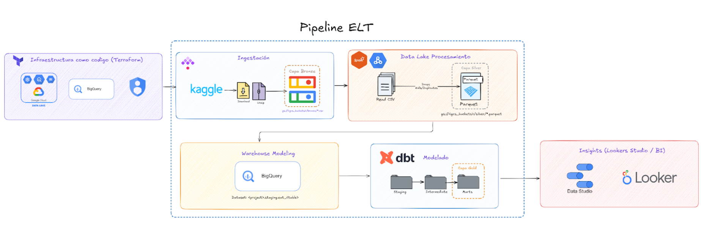

# 🛒 Olist E-Commerce — Pipeline ELT End-to-End

> Arquitectura Lakehouse + Medallion con modelado Kimball sobre Google Cloud Platform

---
## 👥 Equipo

| Nombres |
|---|
| Alcántara Rodriguez, Piero Arturo | 
| Davalos Alfaro, Marisella Lisset | 
| Leyva Valqui, Gabriel Adolfo | 
| Rodriguez Gonzales, Alejandro Valentino | 
| Saldarriaga Urquizo, Pedro Leonardo | 

## 📌 Problemática

Las plataformas de comercio electrónico actuales generan grandes volúmenes de datos distribuidos a lo largo de todo el ciclo de vida del pedido: desde la colocación de la orden hasta la entrega final y la evaluación del cliente. Cada etapa produce registros detallados de transacciones, métodos de pago, desempeño de vendedores y experiencia del consumidor, generando una gran cantidad de **data estructurada pero dispersa entre distintas tablas relacionales**.

Este proyecto aborda dicha problemática tomando como caso de estudio a **Olist**, una de las principales plataformas de marketplace de Brasil, cuyo ecosistema de datos comprende aproximadamente **100 mil órdenes registradas entre 2016 y 2018**. El análisis manual de este volumen de información resulta ineficiente y propenso a errores, por lo que existe una necesidad concreta de construir un **pipeline automatizado y de extremo a extremo** que transforme datos transaccionales en bruto en conocimiento accionable para los tomadores de decisión.

### 🎯 Preguntas Estratégicas

| # | Dimensión | Pregunta |
|---|-----------|----------|
| 1 | **Tendencias de ventas** | ¿Cómo fluctúan los volúmenes de órdenes a lo largo del tiempo en los distintos estados brasileños? |
| 2 | **Eficiencia logística** | ¿Qué regiones concentran los mayores costos de flete en relación con sus tiempos de entrega? |
| 3 | **Satisfacción del cliente** | ¿Cómo se distribuyen las puntuaciones de reseñas entre las categorías de productos más relevantes? |

---

## 📦 Dataset : Brazilian E-Commerce Public Dataset by Olist

- 🔗 **Fuente:** [Kaggle — Olist Brazilian E-Commerce](https://www.kaggle.com/datasets/olistbr/brazilian-ecommerce)
- 📅 **Período:** 2016 – 2018
- 📊 **Volumen:** ~100,000 órdenes reales (datos anonimizados)
- 🏢 **Proveedor:** Olist Store — marketplace que conecta pequeñas empresas con los principales e-commerces de Brasil

El dataset es un esquema en estrella de 9 tablas relacionales que cubren todo el ciclo de vida de una transacción:

| Tabla | Descripción |
|-------|-------------|
| `olist_orders_dataset` | Ciclo de vida de cada orden (status, timestamps) |
| `olist_order_items_dataset` | Ítems por orden, precios y flete |
| `olist_order_payments_dataset` | Métodos y valores de pago |
| `olist_order_reviews_dataset` | Reseñas y puntuaciones de clientes |
| `olist_products_dataset` | Catálogo de productos con categorías y dimensiones |
| `olist_customers_dataset` | Datos geográficos del comprador |
| `olist_sellers_dataset` | Datos geográficos del vendedor |
| `olist_geolocation_dataset` | Coordenadas de códigos postales brasileños |
| `product_category_name_translation` | Traducción de categorías (PT → EN) |

---

## 🏗️ Arquitectura : Lakehouse + Medallion

El pipeline implementa una arquitectura **Lakehouse** sobre Google Cloud con el **patrón Medallion** de tres capas (Bronze → Silver → Gold), siguiendo el **modelo dimensional de Kimball** para el data warehouse.

```
Kaggle → [Bronze: CSV raw] → [Silver: Parquet limpio] → [Gold: Marts Kimball] → BI
```



### Capas del Medallion

| Capa | Almacén | Formato | Descripción |
|------|---------|---------|-------------|
| 🟤 **Bronze** | GCS `bronze/` | CSV comprimido | Datos crudos descargados desde Kaggle sin transformación |
| ⚪ **Silver** | GCS `silver/*.parquet` | Parquet | Datos limpios, deduplicados y tipados via Spark |
| 🟡 **Gold** | BigQuery — `Capa Gold` | Tablas columnar | Modelos dbt: Staging → Intermediate → Marts |

### Modelado Kimball (Star Schema)

El modelo dimensional en la capa Gold sigue el **esquema estrella de Kimball**:

- **Fact Tables:** `fct_orders`, `fct_order_items`
- **Dimension Tables:** `dim_customers`, `dim_sellers`, `dim_products`, `dim_date`, `dim_geography`
- **Marts:** Agregaciones listas para consumo en BI (ventas por estado, NPS por categoría, eficiencia logística)

---

## 🛠️ Tech Stack

### Infraestructura como Código

| Herramienta | Versión | Rol |
|-------------|---------|-----|
| **Terraform** | `>= 1.5.0` | IaC — provisiona GCS buckets, datasets de BigQuery e IAM |
| **Provider Google** | `~> 5.0` | Proveedor oficial de Terraform para GCP |

### Containerización

| Herramienta | Versión | Rol |
|-------------|---------|-----|
| **Docker** | `>= 24.0` | Empaquetado de servicios (Spark, dbt, orquestador) |
| **Docker Compose** | `>= 2.20` | Orquestación local multi-contenedor |

### Procesamiento & Transformación

| Herramienta | Versión | Rol |
|-------------|---------|-----|
| **Python** | `3.11` | Scripts de ingesta, utilidades y DAGs |
| **Apache Spark** | `3.5.x` | Procesamiento distribuido Bronze → Silver (lectura CSV, limpieza, escritura Parquet) |
| **PySpark** | `3.5.x` | API Python para Spark |
| **dbt (data build tool)** | `1.7.x` | Modelado SQL Silver → Gold (Staging, Intermediate, Marts) |
| **dbt-bigquery** | `1.7.x` | Adaptador dbt para BigQuery |

### Cloud & Almacenamiento

| Servicio | Rol |
|----------|-----|
| **Google Cloud Storage (GCS)** | Data Lake — capas Bronze y Silver |
| **BigQuery** | Data Warehouse — capa Gold + consultas analíticas |
| **Google Cloud IAM** | Control de acceso a recursos |

### Visualización

| Herramienta | Rol |
|-------------|-----|
| **Looker Studio (Data Studio)** | Dashboards operativos conectados a BigQuery |
| **Looker** | Exploración semántica avanzada (opcional) |

---

## 📁 Estructura del Proyecto

```
olist-elt-pipeline/
├── terraform/                  # IaC — GCS, BigQuery, IAM
│   ├── main.tf
│   ├── variables.tf
│   └── outputs.tf
├── ingestion/                  # Descarga y descompresión desde Kaggle
│   └── download_kaggle.py
├── spark/                      # Jobs PySpark Bronze → Silver
│   └── bronze_to_silver.py
├── dbt/                        # Modelado dimensional Silver → Gold
│   ├── models/
│   │   ├── staging/            # Capa Staging (fuente limpia)
│   │   ├── intermediate/       # Joins y enriquecimientos
│   │   └── marts/              # Facts y Dims listos para BI
│   └── dbt_project.yml
├── docker-compose.yml          # Stack local completo
├── Dockerfile.spark            # Imagen Spark personalizada
├── Dockerfile.dbt              # Imagen dbt personalizada
└── README.md
```

---

## 🚀 Quickstart

### 1. Pre-requisitos

```bash
# Clonar el repositorio
git clone https://github.com/<tu-usuario>/olist-elt-pipeline.git
cd olist-elt-pipeline

# Variables de entorno requeridas
cp .env.example .env
# Completar: KAGGLE_USERNAME, KAGGLE_KEY, GCP_PROJECT_ID, GCP_REGION
```

### 2. Provisionar infraestructura

```bash
cd terraform/
terraform init
terraform plan
terraform apply
```

> **Proveedor:** `hashicorp/google ~> 5.0`
> **Backend:** GCS remote state

### 3. Levantar el stack local

```bash
docker compose up --build
```

### 4. Ejecutar el pipeline

```bash
# Ingesta → Bronze
docker compose run ingestion python download_kaggle.py

# Bronze → Silver (Spark)
docker compose run spark spark-submit spark/bronze_to_silver.py

# Silver → Gold (dbt)
docker compose run dbt dbt run --profiles-dir . --target prod
docker compose run dbt dbt test
```

---

## 📊 Outputs & Dashboards

Los marts de la capa Gold alimentan directamente Looker Studio con tres vistas principales:

- **📈 Ventas por Estado & Tiempo** — Volumen de órdenes mensual por estado brasileño
- **🚚 Mapa de Eficiencia Logística** — Costo de flete vs. tiempo de entrega por región
- **⭐ Satisfacción por Categoría** — Distribución de review scores en top categorías

---


## 📄 Licencia

Dataset bajo licencia [CC BY-NC-SA 4.0](https://creativecommons.org/licenses/by-nc-sa/4.0/) por Olist.