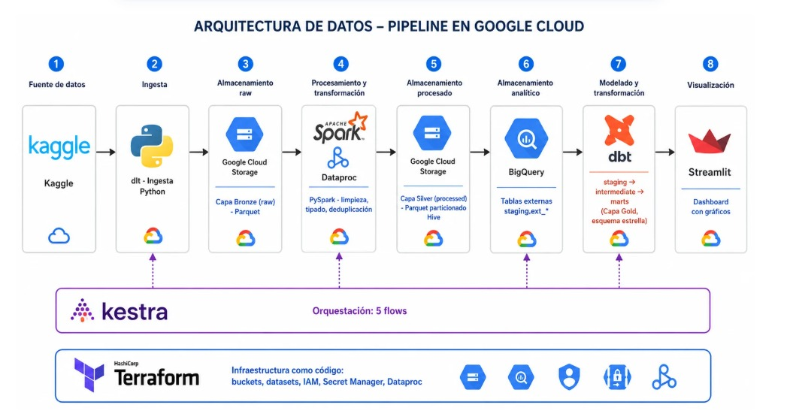

# 🛒 Olist E-Commerce — Pipeline ELT End-to-End

> Arquitectura Lakehouse + Medallion con modelado Kimball sobre Google Cloud Platform, orquestado con Kestra

---
## 👥 Equipo

| Nombres |
|---|
| Alcántara Rodriguez, Piero Arturo |
| Davalos Alfaro, Marisella Lisset |
| Leyva Valqui, Gabriel Adolfo |
| Rodriguez Gonzales, Alejandro Valentino |
| Saldarriaga Urquizo, Pedro Leonardo |

## 📌 Problemática

Las plataformas de comercio electrónico actuales generan grandes volúmenes de datos distribuidos a lo largo de todo el ciclo de vida del pedido: desde la colocación de la orden hasta la entrega final y la evaluación del cliente. Cada etapa produce registros detallados de transacciones, métodos de pago, desempeño de vendedores y experiencia del consumidor, generando una gran cantidad de **data estructurada pero dispersa entre distintas tablas relacionales**.

Este proyecto aborda dicha problemática tomando como caso de estudio a **Olist**, una de las principales plataformas de marketplace de Brasil, cuyo ecosistema de datos comprende aproximadamente **100 mil órdenes registradas entre 2016 y 2018**. El análisis manual de este volumen de información resulta ineficiente y propenso a errores, por lo que existe una necesidad concreta de construir un **pipeline automatizado y de extremo a extremo** que transforme datos transaccionales en bruto en conocimiento accionable para los tomadores de decisión.

### 🎯 Preguntas Estratégicas

| # | Dimensión | Pregunta |
|---|-----------|----------|
| 1 | **Sostenibilidad del ecosistema** | ¿Qué tan rentable y sostenible es el ecosistema Olist, considerando simultáneamente el volumen de ventas, la eficiencia de su cadena logística y el nivel de satisfacción que generan sus vendedores y categorías? |
| 2 | **Revenue vs. Operaciones** | ¿En qué meses el crecimiento de revenue coexistió con un aumento en la tasa de retraso — y cuánto le costó eso en satisfacción? |
| 3 | **Comportamiento de pago** | ¿El número de cuotas elegidas por el cliente predice el tamaño del ticket — y qué umbral de cuotas empieza a degradar la satisfacción? |
| 4 | **Categorías críticas** | ¿Qué categorías son rentables pero logísticamente ineficientes — con alto rendimiento, alta tasa de retraso y score por debajo del promedio global? |

---

## 📦 Dataset : Brazilian E-Commerce Public Dataset by Olist

- 🔗 **Fuente:** [Kaggle — Olist Brazilian E-Commerce](https://www.kaggle.com/datasets/olistbr/brazilian-ecommerce)
- 📅 **Período:** 2016 – 2018
- 📊 **Volumen:** ~100,000 órdenes reales (datos anonimizados)
- 🏢 **Proveedor:** Olist Store — marketplace que conecta pequeñas empresas con los principales e-commerces de Brasil

El dataset es un esquema en estrella de 9 tablas relacionales que cubren todo el ciclo de vida de una transacción:

| Tabla | Descripción |
|-------|-------------|
| `olist_orders_dataset` | Ciclo de vida de cada orden (status, timestamps) |
| `olist_order_items_dataset` | Ítems por orden, precios y flete |
| `olist_order_payments_dataset` | Métodos y valores de pago |
| `olist_order_reviews_dataset` | Reseñas y puntuaciones de clientes |
| `olist_products_dataset` | Catálogo de productos con categorías y dimensiones |
| `olist_customers_dataset` | Datos geográficos del comprador |
| `olist_sellers_dataset` | Datos geográficos del vendedor |
| `olist_geolocation_dataset` | Coordenadas de códigos postales brasileños |
| `product_category_name_translation` | Traducción de categorías (PT → EN) |

---

## 🏗️ Arquitectura : Lakehouse + Medallion

El pipeline implementa una arquitectura **Lakehouse** sobre Google Cloud con el **patrón Medallion** de tres capas (Bronze → Silver → Gold), siguiendo el **modelo dimensional de Kimball** para el data warehouse. Todo el flujo se orquesta de extremo a extremo mediante **Kestra**.

```
Kaggle → [Bronze: GCS raw] → [Silver: Parquet, Dataproc/Spark] → [Gold: Marts Kimball, dbt+BigQuery] → Dashboard (Streamlit)
                                                                                                        
                              └────────────────── Orquestado por Kestra ─────────────────────────────┘
```



### Capas del Medallion

| Capa | Almacén | Formato | Descripción |
|------|---------|---------|-------------|
| 🟤 **Bronze** | GCS `bronze/` | CSV comprimido | Datos crudos descargados desde Kaggle sin transformación |
| ⚪ **Silver** | GCS `silver/*.parquet` | Parquet | Datos limpios, deduplicados y tipados via un job PySpark ejecutado en un clúster efímero de **Dataproc** |
| 🟡 **Gold** | BigQuery — `Capa Gold` | Tablas columnar | Modelos dbt (`transformations/olist`): Staging → Intermediate → Marts |

### Modelado Kimball (Star Schema)

El modelo dimensional en la capa Gold sigue el **esquema estrella de Kimball**:

- **Fact Tables:** `fct_order_items`, `fct_order_reviews`, `fct_payments`
- **Dimension Tables:** `dim_customers`, `dim_sellers`, `dim_products`, `dim_orders`, `dim_dates`
- **Marts:** Agregaciones listas para consumo en el dashboard (ventas, logística, productos, segmentación)

---

## 🛠️ Tech Stack

### Infraestructura como Código

| Herramienta | Rol |
|-------------|-----|
| **Terraform** | IaC en `infra/` — provisiona GCS, BigQuery, clúster/plantilla de Dataproc, IAM y Secret Manager |
| **Provider Google** | Proveedor oficial de Terraform para GCP |

Archivos principales: `apis.tf` (habilitación de APIs), `storage.tf` (buckets GCS), `bigquery.tf` (datasets/tablas), `dataproc.tf` (clúster de procesamiento), `iam.tf` (roles y permisos), `secrets.tf` (Secret Manager).

### Orquestación

| Herramienta | Rol |
|-------------|-----|
| **Kestra** | Orquestador de flujos (`orchestration/`) — ejecuta el pipeline completo desde una sola interfaz declarativa |

Flows definidos en `orchestration/flows/`:

| Flow | Descripción |
|------|-------------|
| `main_bigdata_init_gcp_kv.yml` | Inicializa el KV store / secretos de GCP dentro de Kestra |
| `main_bigdata_ingestion_kaggle_to_gcs.yml` | Descarga el dataset de Kaggle y lo sube a la capa Bronze en GCS |
| `main_bigdata_processing_raw_to_processed.yml` | Levanta el job PySpark en Dataproc: Bronze → Silver |
| `main_bigdata_analytical_model_transformation.yml` | Ejecuta `dbt run`/`test`: Silver → Gold |
| `main_bigdata_warehouse_schema_mapping.yml` | Mapea y valida el esquema del warehouse en BigQuery |
| `main_bigdata_run_full_pipeline.yml` | Flow padre — orquesta los flows anteriores end-to-end |

### Procesamiento & Transformación

| Herramienta | Rol |
|-------------|-----|
| **Python 3.13** | Scripts de ingesta, procesamiento y utilidades (gestionados con `uv`) |
| **Apache Spark / PySpark** | Job `jobs/procesamiento_inicial.py` — limpieza y escritura Bronze → Silver, ejecutado sobre **Dataproc** |
| **gcs-connector-hadoop3** | Conector Hadoop-GCS (`gcs-connector-hadoop3-latest.jar`) para que Spark lea/escriba directamente en GCS |
| **Docker (`custom_images/`)** | Imagen personalizada usada para inicialización del clúster de Dataproc |
| **dbt (data build tool)** | Modelado SQL Silver → Gold en `transformations/olist` (Staging, Intermediate, Marts). Target `dev` en DuckDB local, target de producción en BigQuery |
| **dbt-bigquery** | Adaptador dbt para BigQuery |

### Gestión de dependencias

| Herramienta | Rol |
|-------------|-----|
| **uv** | Gestor de paquetes y entornos Python (`pyproject.toml` / `uv.lock`) |

### Cloud & Almacenamiento

| Servicio | Rol |
|----------|-----|
| **Google Cloud Storage (GCS)** | Data Lake — capas Bronze y Silver |
| **Google Cloud Dataproc** | Clúster efímero para el job PySpark de limpieza (Bronze → Silver) |
| **BigQuery** | Data Warehouse — capa Gold + consultas analíticas |
| **Secret Manager** | Almacenamiento seguro de credenciales usadas por Kestra y Dataproc |
| **Google Cloud IAM** | Control de acceso a recursos |

### Visualización

| Herramienta | Rol |
|-------------|-----|
| **Streamlit** | App multi-página en `dashboard/` — consume los marts desde BigQuery y responde las preguntas estratégicas del proyecto |

El dashboard está organizado en vistas independientes (`dashboard/views/`):

| Vista | Contenido |
|-------|-----------|
| `resumen.py` | KPIs generales y sostenibilidad del ecosistema |
| `ventas.py` | Revenue, crecimiento mensual y tasa de retraso |
| `logistica.py` | Eficiencia logística: fletes, tiempos de entrega, retrasos |
| `productos.py` | Análisis por categoría — rentabilidad vs. eficiencia |
| `segmentacion.py` | Segmentación de clientes/vendedores (incluye modelos en `utils/ml.py`) |
| `arquitectura.py` | Documentación visual del pipeline dentro del propio dashboard |

Utilidades compartidas en `dashboard/utils/`: `bigquery.py` (conexión y ejecución de queries), `queries.py` (SQL parametrizado), `charts.py` (gráficos), `ml.py` (modelos de segmentación/predicción).

---

## 📁 Estructura del Proyecto

```
bigdata-olist-pipeline/
├── infra/                      # IaC — GCS, BigQuery, Dataproc, IAM, Secret Manager
│   ├── apis.tf
│   ├── bigquery.tf
│   ├── dataproc.tf
│   ├── iam.tf
│   ├── main.tf
│   ├── secrets.tf
│   ├── storage.tf
│   └── variables.tf
├── custom_images/               # Imagen Docker custom para el clúster de Dataproc
│   └── Dockerfile
├── gcs-connector-hadoop3-latest.jar   # Conector GCS para Spark/Hadoop
├── keys/                        # Credenciales GCP (fuera de control de versiones)
│   └── google-creds.json
├── ingestion/                   # Descarga desde Kaggle y carga a Bronze (GCS)
│   ├── config.py
│   ├── ingestion.py
│   ├── main.py
│   ├── pipeline.py
│   └── source.py
├── jobs/                        # Jobs PySpark ejecutados en Dataproc
│   └── procesamiento_inicial.py
├── transformations/              # Proyecto dbt
│   └── olist/
│       ├── dbt_project.yml
│       ├── profiles.yml         # target dev: DuckDB · target prod: BigQuery
│       ├── models/
│       │   ├── staging/         # Capa Staging (fuente limpia)
│       │   ├── intermediate/    # Joins y enriquecimientos
│       │   └── marts/           # Facts y Dims listos para BI
│       └── seeds/               # CSVs fuente para desarrollo local
├── orchestration/                # Kestra — orquestación end-to-end
│   ├── docker-compose.yml
│   ├── .env.example
│   └── flows/
│       ├── main_bigdata_init_gcp_kv.yml
│       ├── main_bigdata_ingestion_kaggle_to_gcs.yml
│       ├── main_bigdata_processing_raw_to_processed.yml
│       ├── main_bigdata_analytical_model_transformation.yml
│       ├── main_bigdata_warehouse_schema_mapping.yml
│       └── main_bigdata_run_full_pipeline.yml
├── dashboard/                    # App de visualización (Streamlit)
│   ├── app.py
│   ├── requirements.txt
│   ├── utils/
│   │   ├── bigquery.py
│   │   ├── charts.py
│   │   ├── ml.py
│   │   └── queries.py
│   └── views/
│       ├── resumen.py
│       ├── ventas.py
│       ├── logistica.py
│       ├── productos.py
│       ├── segmentacion.py
│       └── arquitectura.py
├── notebooks/                    # Análisis exploratorio y prototipado
│   ├── procesamiento_inicial.ipynb
│   └── analisis_descriptivo_prescriptivo.ipynb
├── scripts/
│   └── bootstrap.sh              # Setup inicial del entorno
├── olist_raw/                    # Datos crudos locales (desarrollo)
├── images/
│   └── pipeline.jpeg
├── pyproject.toml
├── uv.lock
└── README.md
```

---

## 🚀 Quickstart

### 1. Pre-requisitos

```bash
# Clonar el repositorio
git clone https://github.com/<tu-usuario>/bigdata-olist-pipeline.git
cd bigdata-olist-pipeline

# Sincronizar dependencias Python con uv
uv sync
```

Coloca tu Service Account de GCP en `keys/google-creds.json` (este archivo **no** debe subirse al repositorio).

### 2. Provisionar infraestructura

```bash
cd infra/
terraform init
terraform apply
```

Esto crea los buckets de GCS (Bronze/Silver), los datasets de BigQuery (Gold), la configuración de Dataproc, los roles de IAM y los secretos en Secret Manager.

### 3. Configurar la orquestación (Kestra)

```bash
cd ../orchestration
cp .env.example .env

# Inyectar el Service Account de GCP como secreto (codificado en base64)
echo -e "\nSECRET_GCP_SERVICE_ACCOUNT=$(cat ../keys/google-creds.json | base64 -w 0)" >> .env
```

### 4. Levantar Kestra y ejecutar el pipeline

```bash
docker compose up -d
```

Kestra queda disponible en `http://localhost:8080`. Desde su interfaz:

1. Abre el flow **`main_bigdata_run_full_pipeline`**.
2. Haz clic en **Execute** para lanzar el pipeline completo end-to-end (init de secretos → ingesta Kaggle → Bronze → procesamiento en Dataproc → Silver → dbt → Gold → mapping de esquema).
3. Monitorea la ejecución desde la vista de **Executions** hasta que todos los tasks queden en verde.

### 5. Levantar el dashboard

```bash
cd ../dashboard
uv pip install -r requirements.txt   # o: pip install -r requirements.txt
uv run streamlit run app.py
```

---

## 📊 Outputs & Dashboards

Una vez que la capa Gold está poblada en BigQuery, el dashboard de **Streamlit** (`dashboard/`) expone las siguientes vistas:

- **📋 Resumen** — KPIs generales y sostenibilidad del ecosistema Olist
- **📈 Ventas** — Revenue mensual vs. tasa de retraso en las entregas
- **🚚 Logística** — Costo de flete, tiempos de entrega y cuellos de botella por región
- **📦 Productos** — Categorías rentables pero logísticamente ineficientes
- **🧩 Segmentación** — Segmentación de clientes/vendedores y modelos predictivos (`utils/ml.py`)
- **🏗️ Arquitectura** — Documentación visual del pipeline completo

---

## 📄 Licencia

Dataset bajo licencia [CC BY-NC-SA 4.0](https://creativecommons.org/licenses/by-nc-sa/4.0/) por Olist.